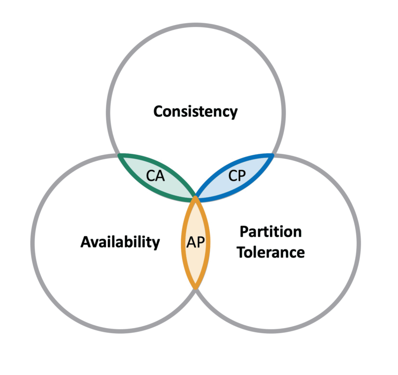

# Databases for Developers - Assignment 2
Andreas Vikke, Asger Sørensen, Martin Frederiksen, William Huusfeldt
## Table of Contents
- [Assignment](#Assignment)
- [Task 1 - Investigation](#Task-1---Investigation)
- [Task 2 - Bloom filters](#Task-2---Bloom-filters)
- [Task 3 - Huffman coding](#Task-3---Huffman-coding)
- [Task 4 - Map and Reduce](#Task-4---Map-and-Reduce)

## Assignment
- [Assignment PDF](./assets/assignment.pdf)

## Task 1 - Investigation
### Produce a small writeup (around 300 words) answering the following questions.

1. What is point of NoSQL databases?
    - The point of NoSQL is generally to to get advantages on performance, scalability and developer usability, over the traditional relational SQL database. By giving up stuff like:
        - Standard domain language
        - Relationship between entities
        - Less structured Data Models
        #### We can gain stuff like:
        - Easy sharding acros clusters
        - Handleling of large volumes of data at high speed with a scale-out architecture.
        - Take full advantage of the cloud to deliver zero downtime. 
2. What is the CAP theorem?
    - 
    CAP Theorem is a choose 2 logic in distributed systems. You have 3 choices but can only choose 2. Here we have "C"onsistency, "A"vailability and "P"artition Tolerance.
    Normal relational SQL databases like MySQL and Postgres is placed in CA, where NoSQL is placed in AP.
3. What are ideal use cases of HBase?
    -  If your application has a variable schema where each row is slightly different, then you should look at HBase. As an example, doing a modeling exercise using a standard relational schema; When you can’t add columns fast enough and most of them are NULL in each row,


## Task 2 - Bloom filters
### Bloom filters are used in hbase as an incredible optimization. Solve the following.
1. What is a bloom filter?
    - A Bloom filter is a data structure designed to tell you, rapidly and memory-efficiently, whether an element is present in a set.
2. What is an advantage of bloom filters over hash tables?
    - A Bloom filter dosn't store the elements themself. Therefore it's more efficient 
3. What is a disadvantage of bloom filters?
    - It's only possible to get a yes or no answer from a Bloom filter, so seeing if something is misspelled a is impolisble
4. Using your language of choice, implement a bloom filter with add and
check functions. The backing bit-array can simply be a long (64 bit
integer).
    - [C# Implementation of Bloom Filter](./BloomFilter/BFilter.cs)
    - [C# Test Function of Bloom Filter](./BloomFilter/Program.cs)
5. If you are to store one million ASCII strings with an average size of 10
characters in a hash set, what would be the approximate space consumption?
    - Each ASCII char is 8 bits or 1 byte, with 1 million strings times 10 bytes per string we got 10 million bytes or 10 megabytes.
6. The following equation gives the required number of bits of space per
inserted key, where E is the false positive rate. 
    ```
    b = 1.44log2(1/E) (1)
    ```
7. How many bits per element are required for a 1% false positive rate?
    - Python:
    ```
    out = (1.44 * math.log2(1.0/0.01)/math.log2(2))
    print("Required bits per element for 1%:", out)

    ===============================================
    Required bits per element for 1%: 9.567152913275603
    ```
8. How many bits per element are required for a 5% false positive rate?
    - Python:
    ```
    out = (1.44 * math.log2(1.0/0.05)/math.log2(2))
    print("Required bits per element for 5%:", out)

    ===============================================
    Required bits per element for 5%: 6.223576456637802
    ```
9. If you are to store one million ASCII strings with an average size of 10
characters in a bloom filter, what would be the approximate space consumption, given an allowed false positive rate of 5%?.
    - Each string should take up 6,22 bits of space.This gives us approximately 6.220.000 bits (0,6 megabyte)


## Task 3 - Huffman coding
### HBase internally uses a compression that is a combination of LZ77 and Huffman Coding
1. Generate Huffmann Code (and draw the Huffmann Tree) based on the
following string: “beebs beepps!!!!! their eerie ears hear pears”
    - [C# Implementation of Huffman Code](./HuffmanCode/HCode.cs)
    ```
    The original string is: beebs beepps!!!!! their eerie ears hear pears
    =====================================================
    Huffman Codes are: [t, 000], [h, 001], [i, 010], [r, 011], [a, 100], [b, 1010], [e, 1011], [s, 1100], [ , 1101], [p, 1110], [!, 1111]
    =====================================================
    The encoded string is: 10101011101110101100110110101011101111101110110011111111111111111111110100000110110100111101101110110110101011110110111000111100110100110111000111101111010111000111100
    =====================================================
    The decoded string is: beebs beepps!!!!! their eerie ears hear pears
    ```
2. How many bits is the compressed string? How many bits is the raw ASCII
string?
    - As each ASCII char takes up 8 bits or 1 byte and the stirng consists of 45 chars, the RAW ASCII string takes up 45 bytes or 360 bits. The encoded message is 145 bits or 18125 bytes as a binary sequence
3. Compress “pete is here” with the Huffmann tree from before.
    ```
    The original string is: pete is here
    =====================================================
    Huffman Codes are: [p, 000], [e, 001], [t, 010], [ , 011], [i, 100], [s, 101], [h, 110], [r, 111]
    =====================================================
    The encoded string is: 000001010001011100101011110001111001
    =====================================================
    The decoded string is: pete is here
    ```

## Task 4 - Map and Reduce
### Solve the following using Javascript, for example in your browser’s developer console.
- [Map Reduce Task](./MapReduce/MapReduce.js)
```
1) Square Root Map:
[ 1, 3, 4, 10 ]

2) Words in <h1> tag:
[
  '<h1>Intro</h1>',
  '<h1>Requirements</h1>',
  '<h1>Analysis</h1>',
  '<h1>Implementation</h1>',
  '<h1>Conclusion</h1>',
  '<h1>Discussion</h1>',
  '<h1>References</h1>'
]

3) Words to uppercase:
[ 'I’M', 'YELLING', 'TODAY' ]

4) Words to transform to length:
[ 1, 4, 10, 5 ]

5) Comic images wrapped:
[
  '',
  '',
  '',
  '',
  '',
  '',
  '',
  ''
]

6) Sum the array of numbers:
15

7) Sum the array of objects x:
{ x: 6 }

8) flaten the array of arrays:
[ 1, 2, 3, 4, 5, 6 ]

9) Possitive numbers array:
[ 3, 1, 2, 4, 5 ]
```